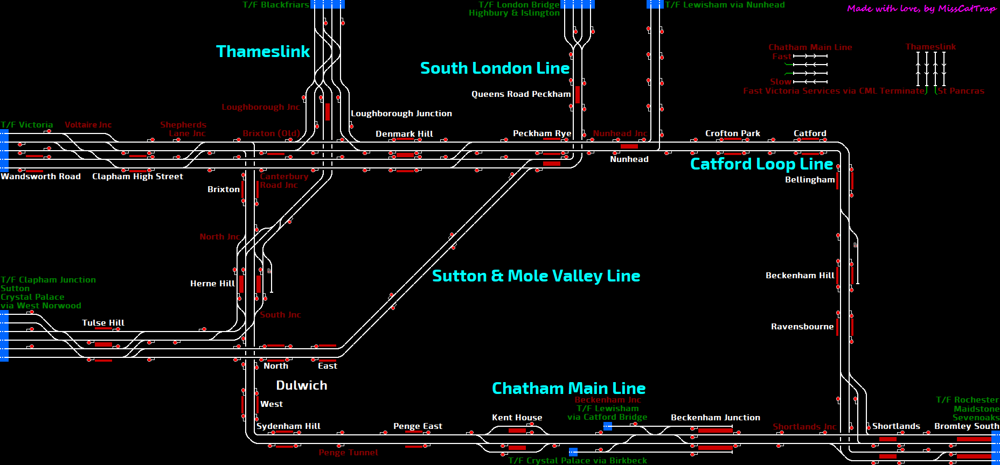

## Chatham Main Line Catford Loop - Wandsworth Road to Bromley South via Catford & Herne Hill

// todo

## Current Status

| Stage         | Status        |
| ------------- |:-------------:|
| Track Plan     | :heavy_check_mark: |
| Signalling      | :heavy_check_mark:      |
| Naming | :heavy_check_mark:      |
| Speed Limits | :heavy_check_mark: |
| Distances | :heavy_check_mark: |
| Timetable | :x: |
| Documentation | :x: |

## Data Sources

- [Open Railway Map](https://www.openrailwaymap.org)
